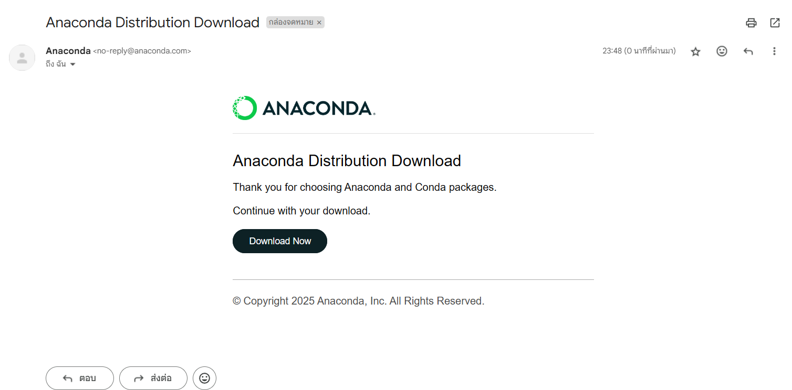
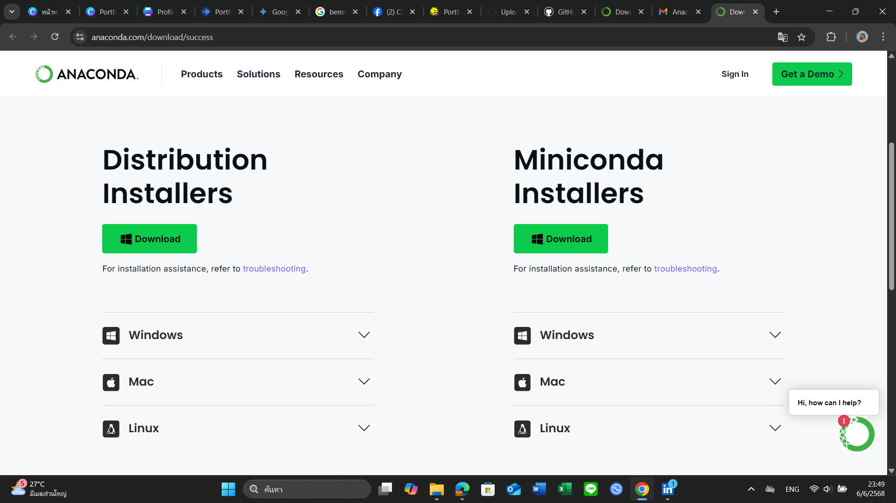

# Mini-Project-Ring-Of-Fire
*For presentation only  
**เนื่องจากเป็นการรัน UI ดังนั้น จึงจำเป็นต้องมีไฟล์รูปภาพเพื่อให้รันได้ แต่ในนี้ไม่มี ดังนั้นจึงแสดงแค่ในส่วนโค้ดเท่านั้น ส่วนหน้า UI จะอยู่ใน Portfolio  
วิธีการรันโค้ดนี้ (For Beginer)(Full Version)  
1.ดาวน์โหลดไฟล์ ring_of_fire.py หรือ โหลดไฟล์ zip  
2.ดาวน์โหลด Ananconda ที่ (https://www.anaconda.com/download)  
 
3.เมื่ออยู่หน้านี้แล้ว ให้ทำการกรอก Email แล้วกด Submit  
  
4.เมื่อมีอีเมลเด้งขึ้นมาให้ทำการกด Download Now  
  
5.เมื่ออยู่หน้าดาวน์โหลดให้ทำการกด Download *กรณีใช้ OS อื่น ให้ทำการกดคลิกเลื่อนลง แล้วทำการกดดาวน์โหลด  
6.เมื่อทำการกดดาวน์โหลดแล้วให้ทำการติดตั้ง โดยการกด Double Click ไปที่ไฟล์ แล้วทำตามขั้นตอนการติดตั้ง  
**** วิธีใช้งาน ****
เมื่อ Anaconda แล้ว ให้ทำการเปิด Pycharm โดยการกด Luanch

